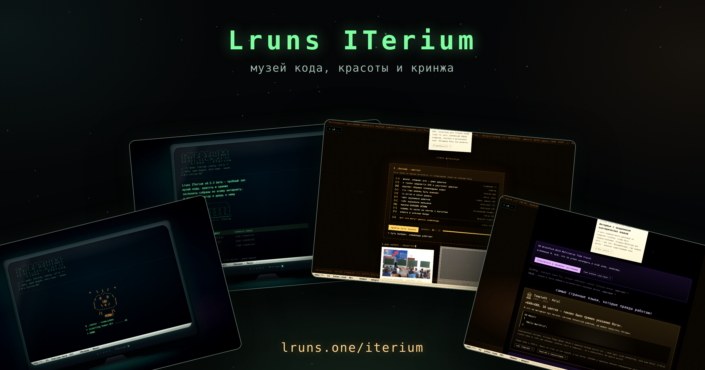
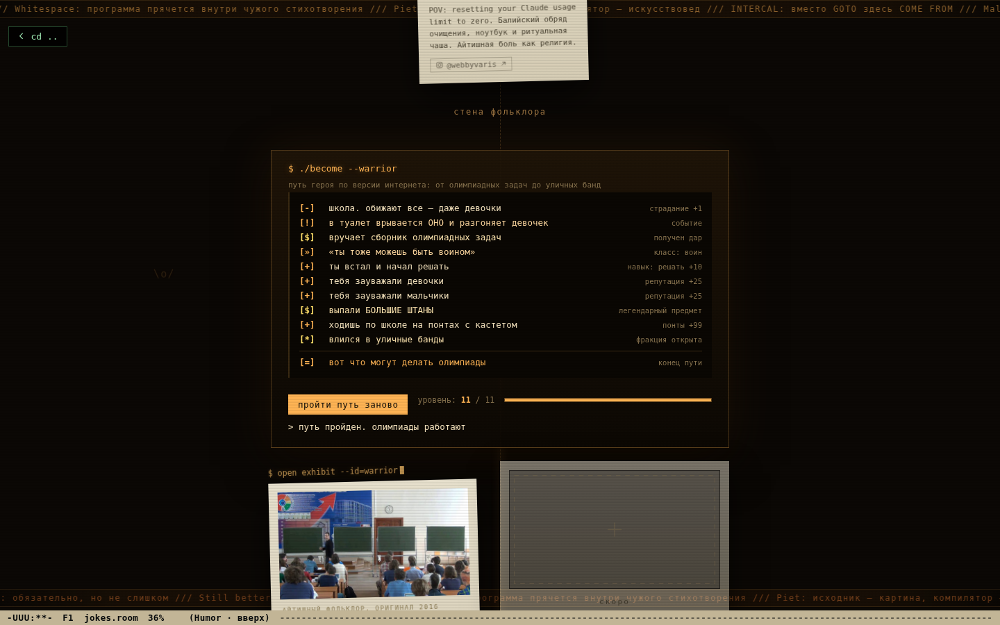
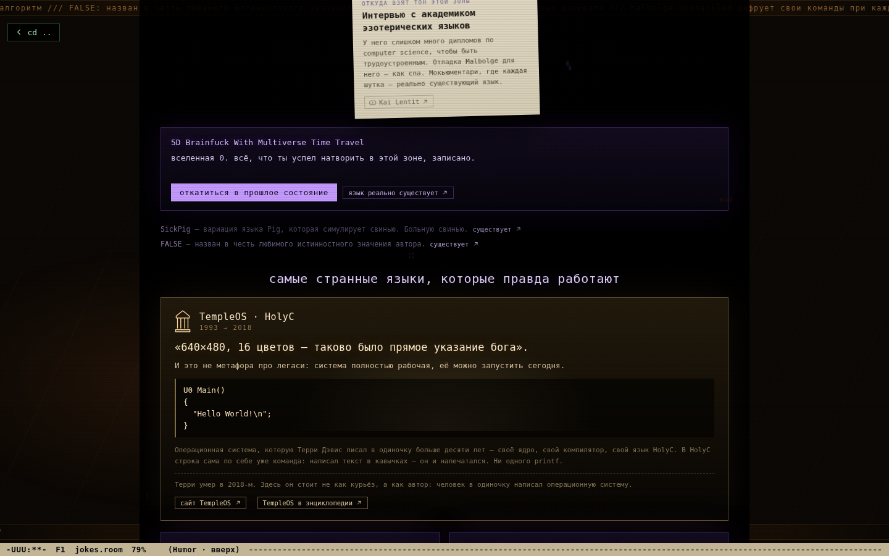

# Lruns ITerium

**Музей кода, красоты и кринжа · [зайти: lruns.one/iterium](https://lruns.one/iterium)** · beta

Я люблю атласы — видели «Карты» Мизелинских? Разворачиваешь, и целый мир
разложен перед тобой. Вот и я стараюсь собрать такое для айти и всего вокруг
кода. Так родился **ITerium — террариум для айти**.

Первая комната — приколы айтишек: сортировка, которая отвлекается на середине;
терминал, требующий вежливости; тёмный угол, где живут настоящие эзотерические
языки… а чего я рассказываю. Просто зайдите и посмотрите — так интереснее
сухого текста =)

| зал шута | магическая зона |
|---|---|
|  |  |

Всё в музее принадлежит своим авторам: у каждой карточки две двери — работа
и страница автора. Если вы автор и против — напишите в issues или t.me/Lruns, будет убрано.

Остальные залы строятся, экспонаты прибывают.

## Как это сделано

TypeScript + esbuild + three.js, без CDN — страница работает даже с `file://`.
Видео грузится только если сами нажали play. `npm install && npm run check`,
дальше просто открыть `index.html`. Интерфейс русский, английский — впереди.

Куратор: Андрей (lruns). И спасибо Claude - без него так и это все и было просто идеей =)

---

*A museum of code, beauty and cringe: working jokes, real esoteric languages and
code-as-art — every exhibit credited and linked to its author. Russian UI for now.
Better to just walk in: **[lruns.one/iterium](https://lruns.one/iterium)***
